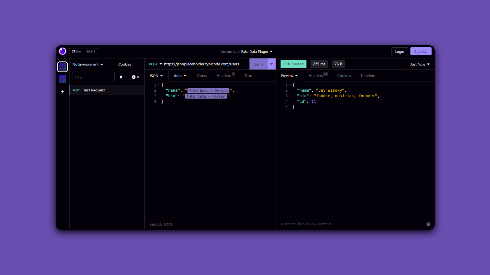

# Projeto TaskList [](https://skillicons.dev)

<p align="center">
  
</p>

***Projeto realizado com o apoio do material***[Curso completo de APIs com Nodejs, Express + MongoDB, SQL](https://www.udemy.com/share/102iPC3@gr-WJSyyttBBDrgOWeOtp_sFqAmr22LgBQOnc9VbeW1D7K1RpOLrijJM_VbWJ-g=/)

## 💻 Pré requisitos
- 🎯 VS Code
- 🎯 NodeJs && NPM
- 🎯 Insomnia
- 🎯 Curl
- 🎯 Yarn
- 🎯 Express
- 🎯 Nodemon
- 🎯 PostgreSQL && Postbird


## 🔧 Alguns comandos de instalação, criação e execução utilizados:

- Instalar yarn
```
sudo apt-get install yarn
```
- Instalar express
```
yarn add express
```
- Instalar nodemon
```
yarn add nodemon
```
- Iniciar servidor
```
yarn dev
```
- Instalar postbird
```
sudo snap install postbird
```
- Instalar sequelize
```
yarn add sequelize-cli -D
```
- Criar migration
```
yarn sequelize migration:create --name=create-nomeMigration
```
- Rodar última migrate criada
```
yarn sequelize db:migrate
```
- Instalar bcrypt
```
yarn add bcrypt
```
- Instalar jwt
```
yarn add jsonwebtoken
```
- Instalar yup
```
yarn add yup
```
- Adicionar CORS
```
yarn add cors
```
